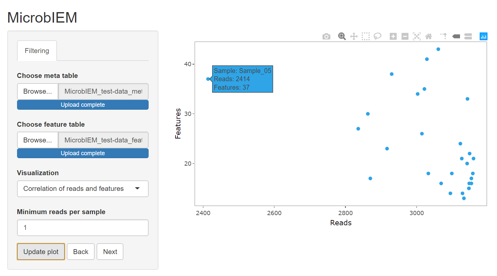
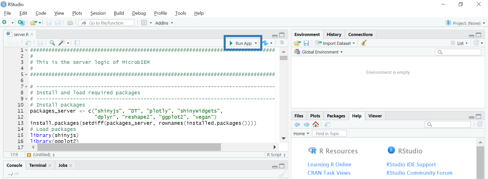
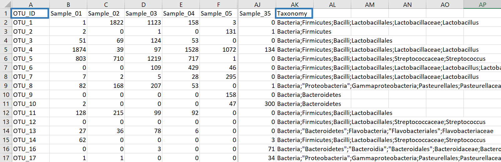
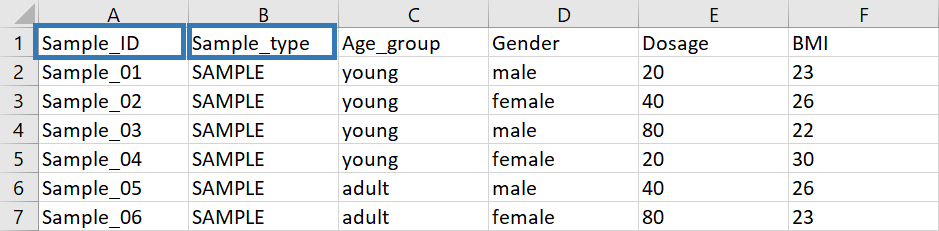
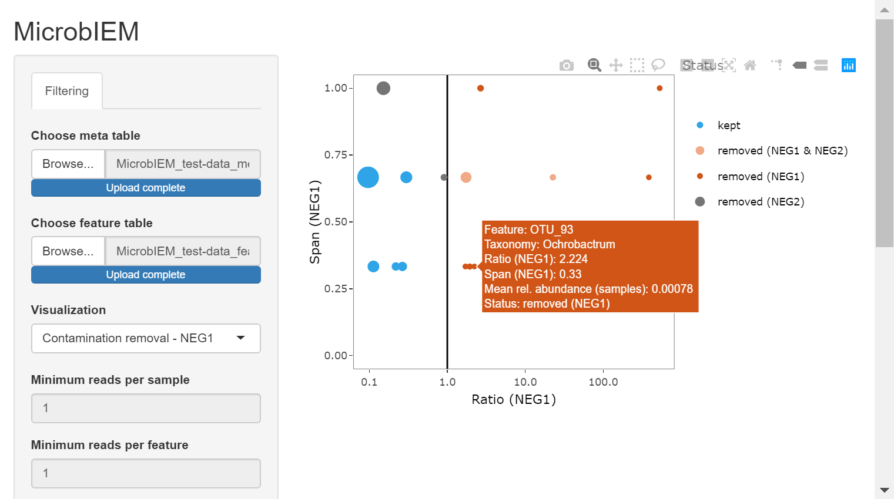
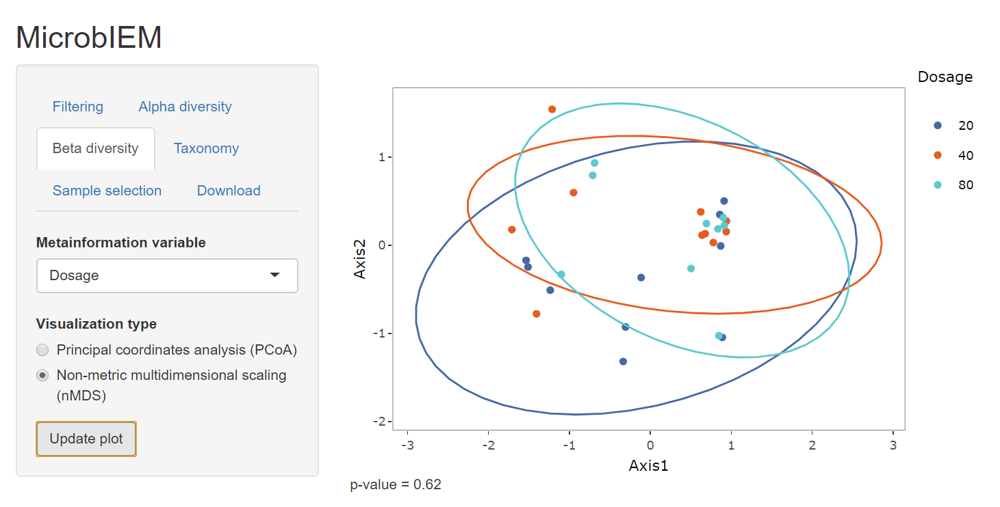
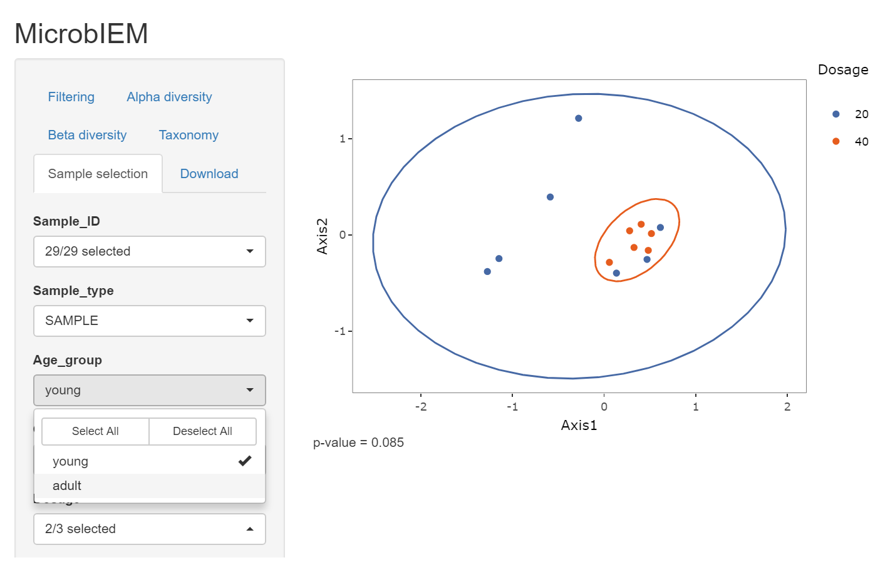
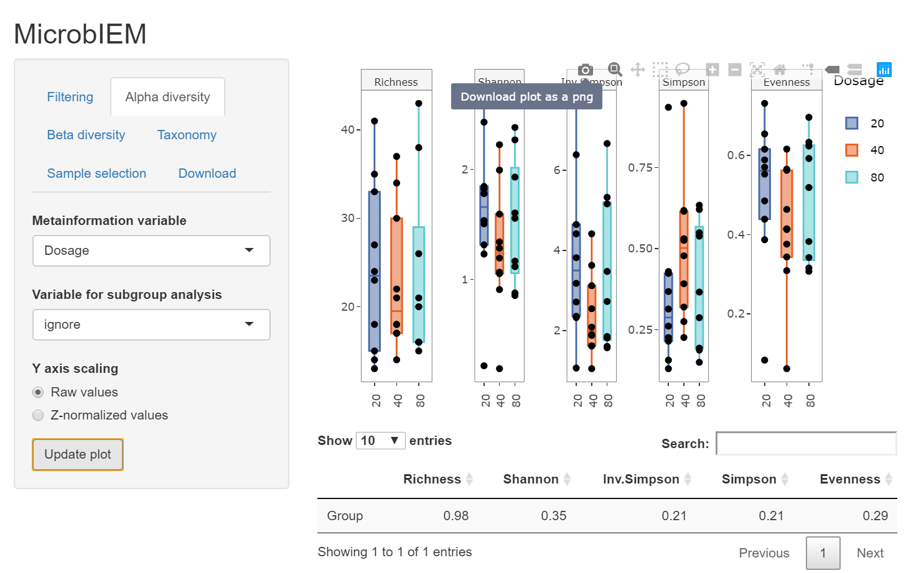
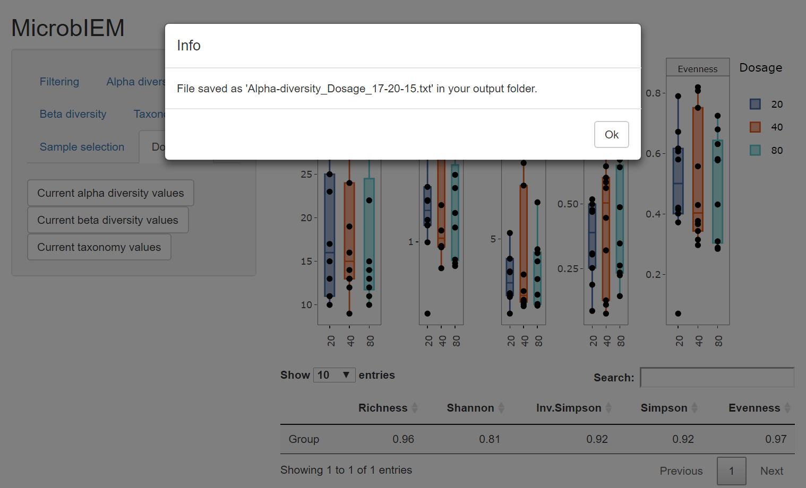

# MicrobIEM

## 1. Overview

 

MicrobIEM is a user-friendly tool for quality control and interactive analysis of microbiome data. A feature table and a metafile of a microbiome study are loaded via the graphical user interface. For each step in quality control, interactive visualisations allow users to explore their data and help defining thresholds for filtering the data. The final data set can then be further investigated with statistical analysis common in microbiome research. Raw data, figures and corresponding p-values can be downloaded in the end. Thus, MicrobIEM is a fast tool that allows the user to explore microbiome data without any knowledge in coding.

#### Available quality control steps:
- Sample filter: by number of total reads
- Feature filter: by maximum absolute abundance and maximum relative abundance
- Contaminant filter: by abundance in negative controls compared to samples

#### Available statistical analyses:
- Alpha diversity (Richness, Shannon, Simpson, Inverse Simpson, Evenness)
- Beta diversity (PCoA, nMDS, on Bray-Curtis dissimilarities)
- Taxonomy analysis

## 2. Installation 
MicrobIEM can be run in two ways - through any web browser without any installation of R or RStudio, or directly through RStudio.

### Running MicrobIEM through a webbrowser
You can run MicrobIEM directly in your web browser without any installation: https://env-med.shinyapps.io/microbiem/

### Running MicrobIEM through RStudio
#### Download R
Download and install the software package R from the [R project website](https://cran.r-project.org/bin/windows/base/). If you already used R on your machine, please update it to at least version 4.0.

#### Download RStudio
Download and install RStudio, an integrated development environment (IDE) for R, from the [RStudio website](https://rstudio.com/products/rstudio/download/).

#### Install Shiny
Once R and RStudio are properly installed, open RStudio and type or copy the following command in the console:
``` r
install.packages("shiny")
```
Pressing enter starts the installation.

#### Download MicrobIEM
Download MicrobIEM and save and unzip the folder on your machine. 

You can download MicrobIEM by clicking the green "Code" button in the top right of this repository and select "Download ZIP".  

#### Start the tool
In your unzipped MicrobIEM folder, do a right-click on the file "server". Click "Open with..." and select RStudio. In RStudio, press the "Run App" button in the upper middle to start MicrobIEM.  
When you start MicrobIEM for the first time, this step may take some minutes because additional packages may need to be installed.
 

## 3. Usage

### Prepare your data
MicrobIEM requires the input data - a feature file and a meta file - to be in a specific format. You can see an example of the required formats in the folder /MicrobIEM-main/MicrobIEM/Test-Data.

#### Featurefile
The feature file can be an OTU table or an ASV table, and contains sequenced read counts for each sample. It should be a tab-separated .txt file. The first column must be called "OTU_ID" and must contain unique names of features. The next columns start with the name of each sample. The last column must be called "Taxonomy" and contain information on taxonomic classification. You can see an example of a correctly formatted feature file  [here](https://github.com/LuiseRauer/MicrobIEM/blob/main/MicrobIEM/test-data/MicrobIEM_test-data_featurefile.txt). 
 

#### Metafile
The metafile contains additional information on each sample. It should be a tab-separated .txt file. The first column must be called "Sample_ID" and contains the same sample names that are found in the featurefile. One column in the metafile must be called "Sample_type" and contain the classification of samples into real samples and positive and negative controls. Please use the following terms to define samples and controls:

- "SAMPLE" for real samples
- "NEG1" or "NEG2" for up to 2 different types of negative controls
- "POS1" for positive controls

You can see an example of a correctly formatted metafile  [here](https://github.com/LuiseRauer/MicrobIEM/blob/main/MicrobIEM/test-data/MicrobIEM_test-data_metafile.txt).

 

### Perform quality control 
 

#### Using only the MicrobIEM decontamination algorithm
Advanced users who want to run the MicrobIEM decontamination algorithm directly in R can download the [MicrobIEM_decontamination.R function](https://github.com/LuiseRauer/MicrobIEM/blob/main/MicrobIEM_decontamination.R) and check out the [example code](https://github.com/LuiseRauer/MicrobIEM/blob/main/MicrobIEM_decontamination_example.R).

### Explore your data
 

### Select samples of interest
 

### Save your figures
 

### Save your results
 

## 4. Cite this tool

If you use this tool, please cite it as:

Hülpüsch C & Rauer L, Nussbaumer T, Schwierzeck V, Bhattacharyya M, Erhart V, Traidl-Hoffmann C, Reiger M & Neumann AU (2021). MicrobIEM - A user-friendly tool for quality control and interactive analysis of microbiome data. https://github.com/LuiseRauer/MicrobIEM

