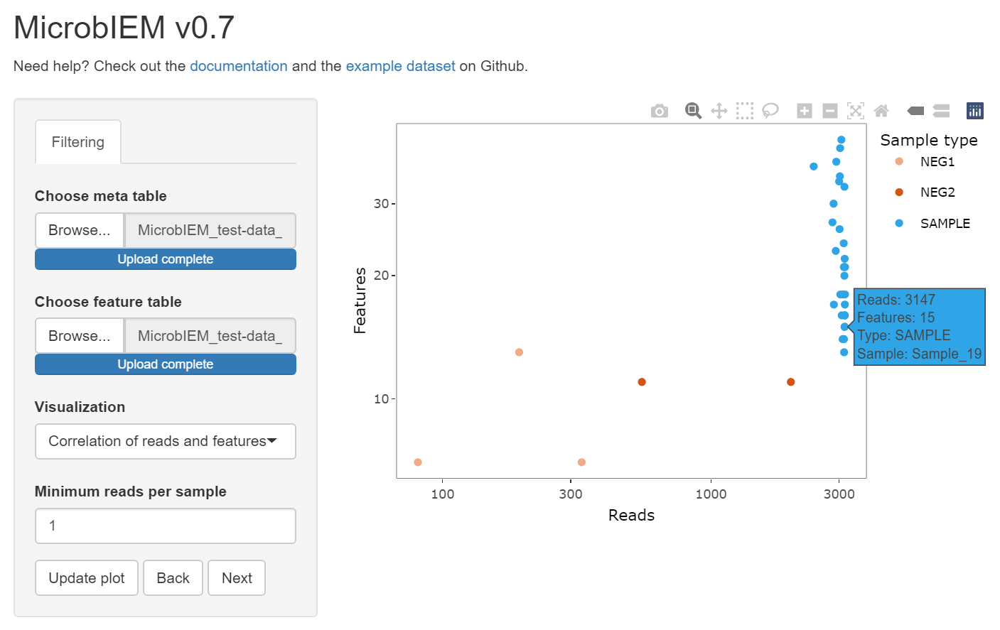
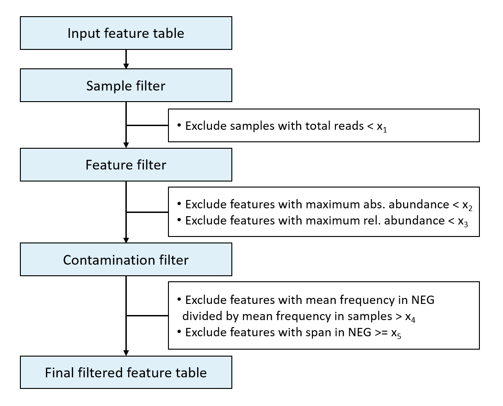

# MicrobIEM

MicrobIEM is a user-friendly tool for quality control, contaminant removal, and interactive analysis of microbiome data. Data from a microbiome study can be loaded via the graphical user interface. For each step in quality control, interactive visualizations enable the users to explore their samples and define thresholds for filtering the data. The user can then further investigate the final data set in MicrobIEM with basic statistical analysis common in microbiome research. Raw data, figures, and corresponding p-values can be downloaded at the end. MicrobIEM is a fast tool allowing users to curate and explore microbiome data without any coding knowledge.

 

## Table of contents 

1.  [Overview of methods](#overview-of-methods)
2.  [Installation](#installation)
    - [Recommended: Running MicrobIEM through a webbrowser](#recommended-running-microbiem-through-a-webbrowser)
    - [Running MicrobIEM through RStudio](#running-microbiem-through-rstudio)
3.  [Usage](#usage)
    - [Prepare your data](#prepare-your-data)
        - [Featurefile](#featurefile)
        - [Metafile](#metafile)
        - [Input from QIIME2 and taxonomy file](#taxonomyfile)
    - [Quality control with MicrobIEM](#quality-control-with-microbiem)
        - [Sample filter](#sample-filter)
        - [Feature filter](#feature-filter)
        - [Contamination filter](#contamination-filter)
    - [Save your results](#save-your-results)
    - [Explore your data: Basic statistical analyses](#explore-your-data-basic-statistical-analyses)
        - [Alpha diversity](#alpha-diversity)
        - [Beta diversity](#beta-diversity)
        - [Taxonomic composition](#taxonomic-composition)
    - [Select samples of interest](#select-samples-of-interest)
    - [Save your figures](#save-your-figures)
4.  [Advanced users: stand-alone MicrobIEM decontamination algorithm](#advanced-users-stand-alone-microbiem-decontamination-algorithm)
5.  [Cite this tool](#cite-this-tool)
6.  [References](#references)

## 1. Overview of methods

Available quality control steps:

- Sample filter: by number of total reads
- Feature filter: by maximum absolute abundance and maximum relative abundance
- Contaminant filter: by abundance in negative controls compared to samples, and span in negative controls

Available statistical analyses:

- Alpha diversity (Richness, Shannon, Simpson, Inverse Simpson, Evenness)
- Beta diversity (PCoA, nMDS, on Bray-Curtis dissimilarities)
- Taxonomic composition

## 2. Installation 

MicrobIEM can be run in two ways:  

- Through any web browser without any installation,  
- Through RStudio after installing R and RStudio.  

### Recommended: Running MicrobIEM through a web browser
You can run MicrobIEM directly in your web browser without any installation: https://env-med.shinyapps.io/microbiem/

### Running MicrobIEM through RStudio
#### Download R
Download and install the software package R from the [R project website](https://cran.r-project.org/bin/windows/base/). If you already used R on your machine, please update it to at least version 4.0.

#### Download RStudio
Download and install RStudio, an integrated development environment (IDE) for R, from the [RStudio website](https://rstudio.com/products/rstudio/download/).

#### Install Shiny
Once you have installed R and RStudio, open RStudio and type or copy the following command in the console:
``` r
install.packages("shiny")
```
Pressing enter starts the installation.

#### Download MicrobIEM
Download MicrobIEM and save and unzip the folder on your machine. 

You can download MicrobIEM by clicking the green "Code" button in this repository's the top right and selecting "Download ZIP".  

#### Start the tool
In your unzipped MicrobIEM folder, do right-click on the file "server". Click "Open with..." and select RStudio. In RStudio, press the "Run App" button in the upper middle to start MicrobIEM.  
When you start MicrobIEM for the first time, this step may take some minutes because additional packages may need to be installed.

 

## 3. Usage

### Prepare your data
MicrobIEM requires two files as input data: a feature file and a metafile. The two files can be formatted in various data types (see below). You can see an example of the required format in the folder /MicrobIEM-main/MicrobIEM/Test-Data ([here](https://github.com/LuiseRauer/MicrobIEM/blob/main/MicrobIEM/test-data)) on Github. You can also download the test data in .txt format from the [OSF platform](https://osf.io/xvbef/).

#### Featurefile
The feature file can be an OTU table or an ASV table and contains sequenced read counts for each sample. It should be a tab-, comma-, or space-separated .csv/.tsv/.txt file. The first column must be called "OTU_ID" and contain unique names of features. The following columns start with the name of each sample. The last column must be called "Taxonomy" and contain information on taxonomic classification, with taxonomic levels separated by semicolons. You can see an example of a correctly formatted feature file  [here](https://github.com/LuiseRauer/MicrobIEM/blob/main/MicrobIEM/test-data/MicrobIEM_test-data_featurefile.txt) or download it directly from the [OSF platform](https://osf.io/5w4ve). 

 

#### Metafile
The metafile contains additional information on each sample. It should be a tab-, comma-, semicolon-, or space-separated .csv/.tsv/.txt file. The first column must be called "Sample_ID" and contains the same sample names that are found in the featurefile. One column in the metafile must be called "Sample_type" and contain the classification of samples into real samples and positive and negative controls. Please use the following terms to define samples and controls:

- "SAMPLE" for real samples
- "NEG1" or "NEG2" for up to 2 different types of negative controls
- "POS1" for positive controls

You can see an example of a correctly formatted metafile  [here](https://github.com/LuiseRauer/MicrobIEM/blob/main/MicrobIEM/test-data/MicrobIEM_test-data_metafile.txt) or download it directly from the [OSF platform](https://osf.io/fjbd2).

 

Typical negative controls are pipeline negative controls (here: NEG2), which gather contaminants over the complete data generation pipeline, and PCR controls (here: NEG1), which are added before the PCR amplification [(Hornung, Zwittink, and Kuiper 2019)](#references).

#### Input from QIIME2 and taxonomy file
MicrobIEM also offers the possibility to upload files from QIIME2. Therefore, MicrobIEM requires a feature file and a taxonomy file in .qza format, as provided by QIIME2. The metafile still needs to be prepared by the user in the format described above.

### Quality control with MicrobIEM 



Several optional steps for quality control are available in MicrobIEM: 

-	Sample filter: Exclusion of samples with low total reads, i.e., low sequencing depth 
-	Feature filter: Exclusion of features (ASVs/OTUs) with low abundance, available as:
    - Exclusion of features with low absolute abundance, i.e., low number of reads (e.g., singletons)
    -	Exclusion of features with a low relative abundance
-	Contamination filter: Exclusion of contaminant features (ASVs/OTUs) based on negative controls

To visualize the effect of each filter setting (x~1~-x~5~), several interactive plots are provided in MicrobIEM:

-	Correlation of reads and features: to check for sufficient sequencing depth per sample
-	Change in feature abundance: to check the number of reads per feature before and after the application of filter settings
-	Contamination removal – NEG1 based: to check which features present in the NEG1 control are removed
-	Contamination removal – NEG2 based: to check which features present in the NEG2 control are removed
-	Reduction of total reads per step: to check the impact of each filtering step on the data set

The available quality control steps in MicrobIEM can be either used as described or skipped (partially or altogether) to proceed directly to microbiome data analysis.  
To apply new settings and explore the effect on the interactive plots in a specific step, press "Update plot". When you decide on a setting and would like to proceed to the next step, press "Next". To re-adjust settings in a previous step, press "Back".

#### Sample filter
Low sequencing depth – i.e., low number of reads per sample – is a hint towards experimental failure due to technical problems in sampling or amplification [(Lagkouvardos et al. 2017)](#references). Thus, those samples should be removed from the analysis. The sequencing depth varies between sequencing runs, therefore no general advice on a minimum sequencing depth can be given. However, the following parameters may be considered when excluding samples: the number of reads in the PCR control and the distribution of reads and features over samples.  
The PCR control (here: NEG1) should contain only a low number of reads. When PCR controls have similar levels of reads as the samples, this hints towards contamination in the sequencing run or a general failure of the experiment. As no bacteria are expected in the PCR control, one option is to exclude samples with fewer reads than in the PCR controls. MicrobIEM displays the number of reads and features in the plot "Correlation of reads and features" for each sample and NEG1 and NEG2 controls (as defined in the metadata table). The pipeline control (here: NEG2) is more suitable for decontamination and may be neglected in the sample filter step. Depending on the sampled environment, pipeline controls may have similar numbers of reads as found in samples.  
A second indicator for a high quality of the sequencing run is the absence of a correlation between the number of reads (= sequencing depth) and the number of features (= richness), which can also be checked in MicrobIEM’s plot "Correlation of reads and features". Sequencing depth strongly effects richness [(Sanchez-Cid et al. 2022)](#references); thus, sequencing sufficiently deep should result in a read-independent number of features per sample. 

 

#### Feature filter
Features with a low maximum absolute abundance over all samples (e.g., singletons or doubletons) or with a low maximum relative abundance over all samples (equivalent to the Frequency filter) can be removed as they may represent spurious sequencing errors [(Reitmeier et al. 2021)](#references). The plot "Change in feature abundance" is suitable for checking the feature abundance before and after applying filter settings.

#### Contamination filter
In MicrobIEM, contaminant removal is based on negative controls. As identifying contaminant features solely by their presence in negative controls is not recommended [(Karstens et al. 2019)](#references), we implemented two new concepts in MicrobIEM: 1) the ratio of the mean relative abundance of a sequence in negative controls versus in environmental samples, since a "systematic" contaminant (i.e., not sporadic, e.g., originating from lab consumables) should appear in rather high relative abundance in the expectably empty negative controls, and 2) a span threshold measuring the proportion of negative control samples contaminated with this sequence, since "systematic" contaminants should not appear only sporadically in a small fraction of negative controls.  
These contamination filters (span and ratio) can be applied independently for two types of controls (NEG1 and NEG2, e.g., PCR and Pipeline negative control). We recommend using the pipeline negative controls for contaminant removal since contaminants from all steps from sampling to sequencing should accumulate in these controls.  
The interactive "Contamination removal plots" are suitable for checking which features occur in the respective negative controls. Bubble size indicates the mean relative abundance per feature in samples, and colors indicate whether these features are kept or removed by the current settings. Hovering over the bubbles gives further information on each feature, e.g., about its taxonomic annotation to the level provided. The taxonomic annotation per feature can be further compared to typical contaminants described in the literature, e.g., as can be found in [(Eisenhofer et al. 2019)](#references). 

 

### Save your results

After quality control has been performed successfully, the user proceeds to data analysis. Before analyzing your data, we recommend downloading MicrobIEM's files from the "Download" section to your computer. You can select between tab-separated .txt files and comma-separated .csv files.

 

### Explore your data: Basic statistical analyses

The final filtered feature table can be explored and visualized with the most common analyses for microbiome research: alpha diversity, beta diversity, and the distribution of microbial taxa (taxonomic composition). 

#### Alpha diversity
Within-sample alpha diversity can be estimated by two contrasting components: richness, the number of taxa present, and evenness, the uniformity of taxa distributions.  
In practice, alpha diversity is frequently reported by "mixed" measures of alpha diversity – such as the commonly used Shannon or Simpson index – which cover the two components in different functions. MicrobIEM provides alpha diversity analyses with pure Richness, pure Evenness, and the mixed measures Shannon, Simpson, and Inverse Simpson diversity index [(Thukral 2017)](#references). Differences in alpha diversity between groups are estimated by a Kruskal-Wallis test.  
MicrobIEM offers alpha diversity analyses for one metainformation variable and one additional variable for subgroup analysis. While every variable given in the metadata can be selected in principle, we recommend using only categorical or nominal variables for alpha diversity analyses. To create aesthetic alpha diversity figures with MicrobIEM, we also recommend using only variables with a maximum of eight different values for the metainformation variable and only variables with a maximum of three different values for the subgroup analysis.  
When you are specifically interested in, e.g., a subgroup analysis of variables with more than three values, we recommend selecting only one subgroup at a time in the sample selection tab and repeating the analysis for every subgroup.

 

#### Beta diversity
Beta diversity in MicrobIEM is estimated by Bray-Curtis dissimilarity between samples. It can be visualized by Principal Coordinates Analysis (PCoA) or non-metric multidimensional scaling (nMDS) [(Ramette 2007)](#references). Differences between groups are assessed using a permutational analysis of variance (PERMANOVA) test. 

 

#### Taxonomic composition

The taxonomic distribution of samples can be visualized for any selected number of the most abundant taxa per sub-group of samples or all samples together and for all taxonomic levels available in the annotation provided in the feature table.

 

### Select samples of interest

When exploring data, samples or groups of samples can be selected dynamically in the section "Sample selection". All variables in the Metadata sheet provided by the user are available for the selection of subgroups. The updated analysis will only be performed after clicking "Update plot" in the respective analysis section.

 

### Save your figures
To save a figure as .png, hover over the plot in MicrobIEM and click "Download plot as png".

 

## 4. Advanced users: stand-alone MicrobIEM decontamination algorithm
Advanced users who want to run the MicrobIEM decontamination algorithm directly in R can download the [MicrobIEM_decontamination.R function](https://github.com/LuiseRauer/MicrobIEM/blob/main/MicrobIEM_decontamination.R) and check out the [example code](https://github.com/LuiseRauer/MicrobIEM/blob/main/MicrobIEM_decontamination_example.R).

## 5. Cite this tool

If you use this tool, please cite it as:

Hülpüsch C & Rauer L, Nussbaumer T, Schwierzeck V, Bhattacharyya M, Erhart V, Traidl-Hoffmann C, Reiger M & Neumann AU (2021). MicrobIEM - A user-friendly tool for quality control and interactive analysis of microbiome data. https://github.com/LuiseRauer/MicrobIEM

## 6. References

Eisenhofer R, Minich JJ, Marotz C, Cooper A, Knight R, Weyrich LS. Contamination in Low Microbial Biomass Microbiome Studies: Issues and Recommendations. Trends Microbiol 2019;27(2):105-17.  
  
Hornung BVH, Zwittink RD, Kuijper EJ. Issues and current standards of controls in microbiome research. FEMS Microbiology Ecology 2019;95(5).  
  
Karstens L, Asquith M, Davin S, Fair D, Gregory WT, Wolfe AJ, et al. Controlling for Contaminants in Low-Biomass 16S rRNA Gene Sequencing Experiments. mSystems 2019;4(4):e00290-19.  
  
Lagkouvardos I, Fischer S, Kumar N, Clavel T. Rhea: a transparent and modular R pipeline for microbial profiling based on 16S rRNA gene amplicons. PeerJ 2017;5:e2836.  
  
Ramette A. Multivariate analyses in microbial ecology. FEMS microbiology ecology 2007;62(2):142-60.  
  
Sanchez-Cid C, Tignat-Perrier R, Franqueville L, Delaurière L, Schagat T, Vogel TM. Sequencing Depth Has a Stronger Effect than DNA Extraction on Soil Bacterial Richness Discovery. Biomolecules 2022;12(3).  
  
Thukral A. A review of measurement of alpha diversity in biology. Agric Res J 2017;54(1):1-10.  
